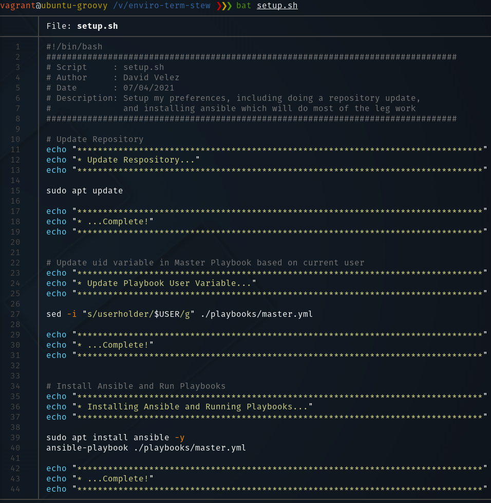
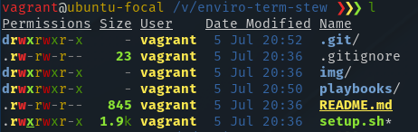
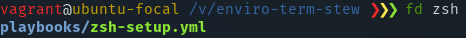
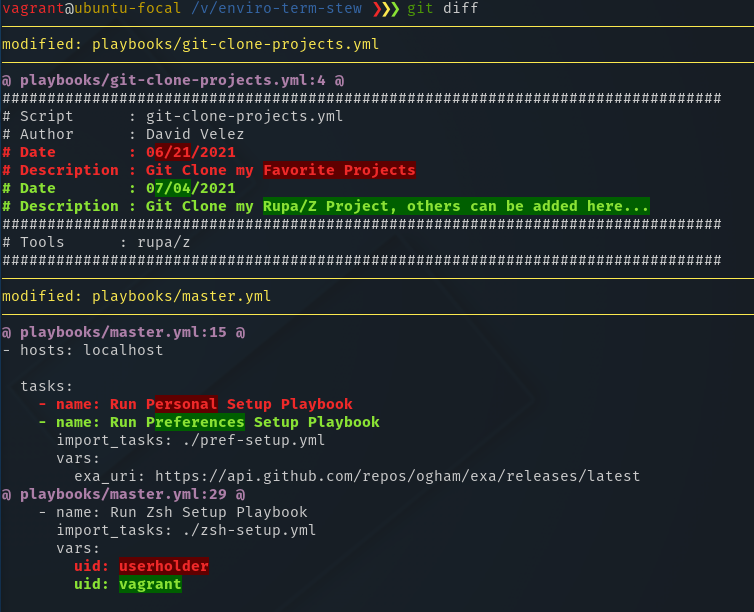
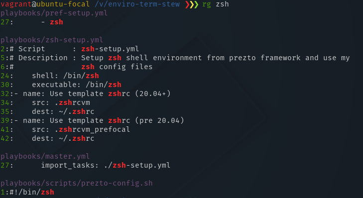
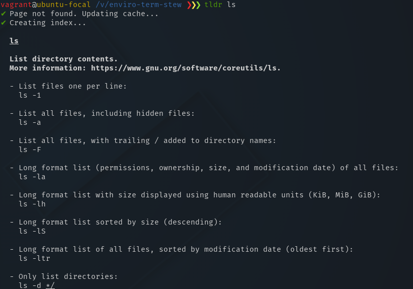
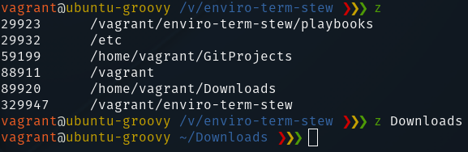

# Terminal Environment Setup
*This stew sets up the linux environment (Pop OS/Ubuntu) to my preferences, including downloading packages I normally use*


## Instructions

This stew is designed to work with Ubuntu and Pop OS 20.04 and above. Many packages are not available pre-focal. Anything before that needs to be conditioned to work with your environment using something like snap packages. Possible update in the future.

**Note for users with pre-existing .zshrc files**: If you already have a pre-existing .zshrc file, it would be a good idea to look in the ./playbooks/templates directory and update .zshrcvm if you are using Ubuntu/Pop 20.04 and above, or .zshrcvm_prefocal for previous versions. Update as needed for your environment in these cases.

### Automated Setup

This setup is relatively easy and straight forward, but running the **setup.sh** script will do all the legwork with no issues.

```bash
./setup.sh
```

Each script and playbook have descriptions on what they do so they can be maintained there.

Once the execution for the setup script is complete, `exit` your shell and relaunch your terminal. Changes should now be now visible.

**NOTE**: In the home directory, the `~/.gitconfig` file has a git user section that needs to be updated with your git information if you plan on using git. Just replace the placeholders with your own information.


## Zsh with Prezto

Prezto is a great framework for Zsh, including command completion, globbing, git prompt particulars, terminal shell highlighting, history shortcuts, and more. Look in the references section at the bottom of this README for more details.


## Usage of CLI Tools

When you are back in your terminal shell environment, you will see that you are using z-shell (zsh). Some of the tools that are installed can come pretty handy. Here are some examples:

### bat

A better way to read files using `bat` with syntax-highlighting. Acts like `less` if the contents doesn't fit unto the screen.




### exa

An `ls` syntax highlighting library



### fd

A fast alternative to `find`. It's simple and easy to use, and super fast.



### diff-so-fancy

A replacement tool for `git diff`. The color highlighting for differences on screen are readable and easy to discern.



### ripgrep

A recursive pattern finder that works similarly to `grep`, but better.



### tldr

The "too long; didn't read" alternative to `man` pages with usage examples.



### z

A tracker that shows the most frequently used directories with a weight based on that frequency. You can also `z` jump to a directory quickly.




## References

- [Awesome CLI Tools](https://www.vimfromscratch.com/articles/awesome-command-line-tools/)
- [Better ZSH with Prezto](https://wikimatze.de/better-zsh-with-prezto/)
